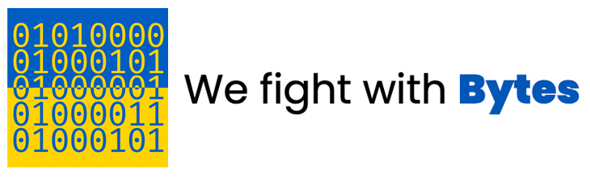

#StopWarNow - The Digital way

URL: https://ghostsmatters.github.io/stoputin.github.io/

## What is this?

This site has been inspired by the Ukraine government’s call for IT professionals to help assist against the disruption of Russian propaganda.

Built by technology professionals, motivated to use their skills to help support the Ukraine, and find a way to allow non-technical people to help support the cause. It a site that allows anyone with a web browser and internet connectivity to easily participate in disabling and blocking key Russian propaganda sites and services supporting the [Russian invasion of Ukraine](https://en.wikipedia.org/wiki/Russo-Ukrainian_War).

It is simple. Anyone with a web browser, and internet connectivity can participate and show your support. Simply click the Launch button and leave this running in the background whilst most of us go safely about our days.

All we are donating is our data!

## Are there any other ways to help?

Absolutely.
- Please consider donating to the [International Committee of the Red Cross for Ukraine Crisis](https://www.icrc.org/en/donate/ukraine). 
- For other technically inclined people out there who want to contribute please consider joining the [IT Army of Ukraine](https://t.me/itarmyofukraine2022).

### Do you collect / sell / share any data?
A: No, we do not know who you are using our tool and we do not share it with any 3rd party.